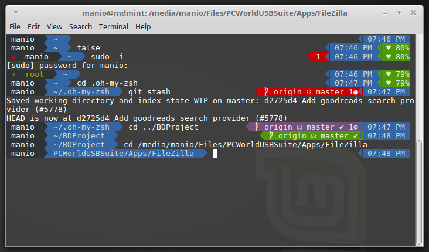

# agzakmd theme for oh-my-zsh
**agzakmd** is a theme based on both [agnoster](https://github.com/agnoster/agnoster-zsh-theme) and [agnosterzak](https://github.com/zakaziko99/agnosterzak-ohmyzsh-theme) themes. I find them both very good but something was missing so I played with the configuration for a couple of hours and produced this theme.

What it shows:

* Username
* Python environment (if active)
* Current path (limited to 3 levels up)
* Git status (as well as Bazaar and Mercurial)
* Current time
* Battery life

## Preview

